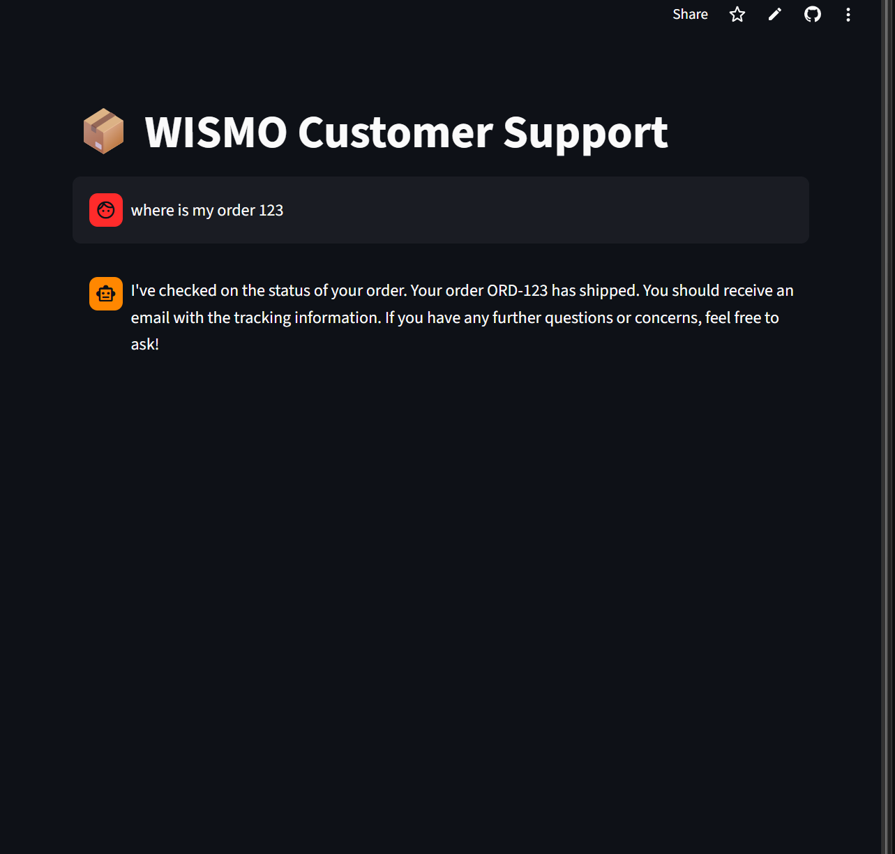
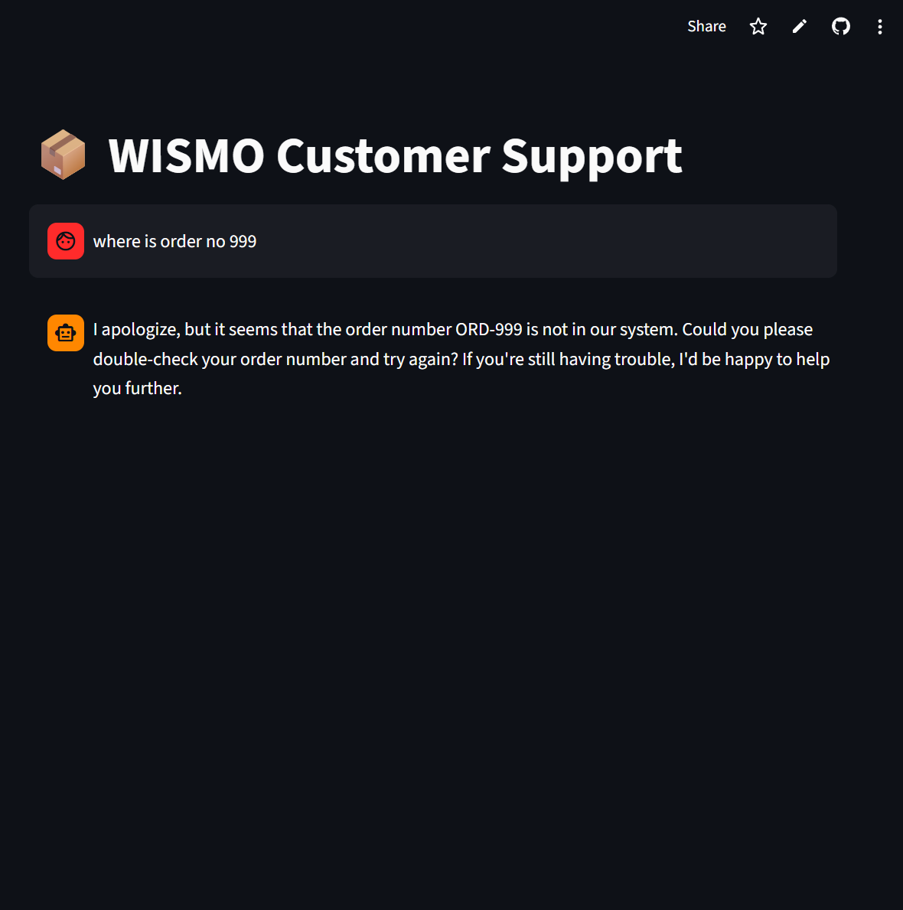
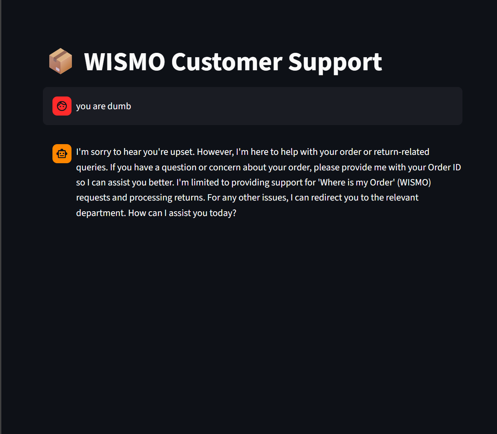

# 📦 WISMO Customer Support Bot

An AI-powered customer support chatbot for handling **Where Is My Order (WISMO)** requests and **return processing** in an e-commerce setting.

## 🚀 Live Demo
[Access the Live Application](https://wismo-support-bot-4zfnlv7lz7bq4odu85tbnk.streamlit.app/)

---

## 📖 Overview

The **WISMO (Where Is My Order) Customer Support Bot** is a conversational AI application built to handle common customer service requests for an e-commerce store.

It is developed with **Streamlit** and powered by **Groq’s high-speed inference API** using the **Llama-3.3-70B-Versatile** model. The bot uses **LLM function calling** to connect natural language user requests to backend Python functions for order tracking and return processing.

This project demonstrates how a focused single-agent chatbot can:
- respond naturally to customer questions
- extract important variables like order IDs
- trigger backend functions
- stay within a defined support scope

---

## ✨ Key Features

### 1. Automated Order Tracking
Customers can ask about their order status in natural language.  
The bot extracts the relevant **Order ID** and calls a backend function to retrieve the latest shipping information.

### 2. Return Processing
The bot can process return requests by collecting:
- **Order ID**
- **Reason for return**

It then generates a unique **return tracking number**.

### 3. Scope Management
The assistant is intentionally limited to:
- order status requests
- return-related support

If a user asks about unrelated topics such as technical support or company history, the bot politely redirects them.

### 4. Dynamic Function Calling
The app uses the **OpenAI Python SDK structure**, redirected to the **Groq API base URL**, to map user intent directly to backend Python functions such as:
- `check_order_status`
- `process_return`

---

## 🖼️ Screenshots

### Successful Order Retrieval


### Handling Unrecognized Orders


### Scope Guardrail / Off-Topic Handling


---

## 🛠️ Technology Stack

- **Frontend:** Streamlit  
- **Language Model:** Llama-3.3-70B-Versatile  
- **API Provider:** Groq  
- **Integration:** OpenAI Python SDK  
- **Backend Logic:** Python functions for order tracking and return handling  

---

## 📂 Project Structure

```bash
.
├── app.py
├── README.md
└── .streamlit
    └── secrets.toml
```

## ⚙️ Local Installation and Setup
### 1. Clone the repository
git clone <your-repo-url>
cd <your-repo-folder>
### 2. Install dependencies

Make sure Python is installed, then run:

pip install streamlit openai
### 3. Configure your API key

This application requires a Groq API key.

Create a .streamlit directory in the root of your project, then create a file named secrets.toml inside it.

Add the following:

GROQ_API_KEY = "your_actual_groq_api_key_here"
### 4. Run the application
streamlit run app.py

## 🧪 Testing the Application

When running the application locally, you can test it using the following mock database entries:

ORD-123 → Shipped

ORD-456 → Processing

ORD-789 → Delivered

Any other order number will return a message indicating that the order could not be found in the system.

## 💬 Example Queries

Where is my order ORD-123?

Can you check order ORD-456?

I want to return ORD-789 because it arrived damaged.

Where is order number 999?

## 🎯 Project Scope

This bot is designed as a focused single-agent support assistant.
It is not intended to be a full multi-department customer support system.

Its responsibilities are limited to:

checking order status

processing returns

politely redirecting off-topic requests

## 📌 Notes

This project is a practical demonstration of:

prompt-constrained agent behavior

tool/function calling with LLMs

simple conversational support automation

clean and lightweight deployment with Streamlit

## 📄 License

MIT License
